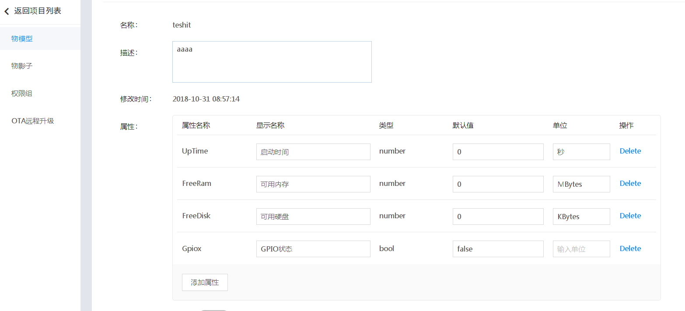
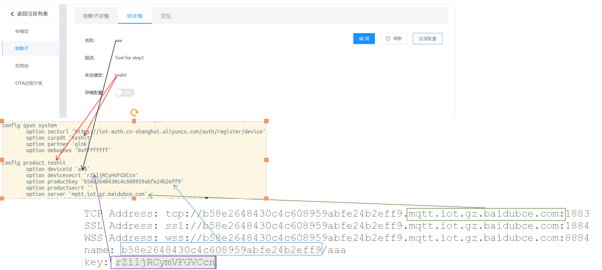
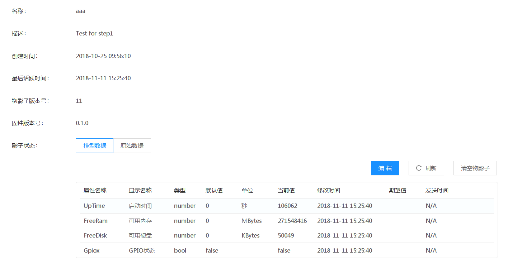

CYUN SDK 物联网设备侧快速产品化SDK
======================================

CYUN SDK是致力于帮助产品快速产品化物联网功能的设备侧SDK.

CYUN SDK在物联网云提供的基础SDK上，
进行了常见产品化功能的开发，开发者可以使用本SDK，更加聚焦于产品核心业务功能，常见产品化功能业务
通过修改配置文件或者直接实现对应接口的函数即可完成.

同时CYUN SDK还对原生SDK进行了优化和增强，以更好的满足实际产品化需要.

## 项目状态: *ALPHA*

在alpha阶段，CYUN SDK 只提供Linux(x86)版本的二进制包(32/64bit).在后续阶段会逐步提供更多平台
的二进制包以及源代码.

## 项目说明 ##

您可以查看下面这些详细文档以更清晰全面的了解CYUN SDK.

[CYUN SDK 详细介绍](docs/CYUNSDK-架构以及优势介绍.md)

[使用CYUN SDK 修改修改配置文件即可连接 百度天工云 ](docs/使用CYUNSDK-修改修改配置文件即可连接-百度天工云.md)

[使用CYUN SDK 修改修改配置文件即可连接 阿里物联网云 ](docs/使用CYUNSDK-修改修改配置文件即可连接-阿里物联网云.md)

[使用CYUN SDK 修改修改配置文件即可连接 腾讯物联网云 ](docs/使用CYUNSDK-修改修改配置文件即可连接-腾讯云.md)

[使用CYUN SDK 修改修改配置文件即可将设备串口收发信息发送到物联网云 ](docs/使用CYUNSDK-修改修改配置文件即可将设备串口收发信息发送到物联网云.md)

---
## Installation ##

直接Clone或者下载即可使用:

    git clone https://github.com/cyunsdk/cyun-sdk　cyunsdk
    cd yunsdk

## 云连接测试 ##

CYUN SDK当前版本支持的物联网云如下表,使用CYUN SDK并不需要单独下载相应云的原生SDK.

| 物联网云         | 原生SDK路径　 | 原生SDK版本 　                                      |
| -------------- | ----------- | ------------------------------------------------- |
| 阿里云          | [阿里云原生SDK][aliyunsdk]   | 2.2.1                                   |
| 百度天工云       | [百度云原生SDK][baidusdk]    |50294a1490f48417e186b44db64a819a0f5f1cba |
| 腾讯云          | [腾讯云原生SDK][wxsdk]       |41ce3ee0907a3ccff64a45db2a77eecc9d588386 |

### 百度云验证测试
---
#### 百度云服务器产品创建以及配置
参考百度云服务器介绍文档在云服务器侧完成产品创建以及参数配置即可

在服务器侧可以添加'物影子信息'如下图,本步骤非必须是可选进行:

注意,如果要测试物影子功能,并且使用CYUN SDK更新物影子状态,上图中属性名称一列必须和上图中严格保持一致,包括大小写

---
#### 测试PC侧（模拟物联网设备）配置修改

    cd bin/x86/64bit/baidu/conf         -->以x86 64位主机为例
    参考下面图片修改此目录下的qyun文件

| 配置文档条目     | 条目含义　　 | 百度云对应字段  | 取值  | 说明               |
| -------------- | ----------- | ------------- | ---------------- | ------------------- |
| curpdt         | 当前使用的产品名称 | 物模型名称  | 参考云服务器定义 | 人可读名称      |
| productkey     | 当前使用的产品ID | name中/之前的部分  | 参考云服务器定义  | 产品名称数字化      |
| productsecrt   | NA       | NA   | NA  | NA |
| deviceid       | 每个设备的唯一标识符  | name中/之后的部分 | 参考云服务器定义  |百度云中，物模型是一个产品的概念，物影子是每个设备实体 |
| devicesecrt    | 每个设备连接服务器的秘钥(证书) | key  | 参考云服务器定义 | 设备秘钥 |

---
#### 测试PC侧（模拟物联网设备）程序运行

    cd bin/x86/64bit/baidu/bin
    ./tryit.sh

tryit.sh　脚本会自动调用qyunali应用程序使用conf目录下的qyun作为配置文件连接百度天工云服务器

---
#### 百度云服务器产品状态检查

设备侧连接成功后,可以在服务器侧检查测试设备的状态信息如下图

---
### 阿里云云验证测试 ###

#### 阿里云云服务器产品创建以及配置
参考阿里云云服务器介绍文档在云服务器侧完成产品创建以及参数配置即可

在服务器侧可以导入物模型文件 bin/aliyun/cyunsdk-ali-model.json,本步骤非必须是可选进行,导入后如下图:

注意,如果要测试物影子功能,并且使用CYUN SDK更新物影子状态,需要导入对应的物模型文件,并且创建的产品需要是高级版

---
#### 测试PC侧（模拟物联网设备）配置修改

    cd bin/x86/64bit/aliyun/conf
    参考下面图片修改此目录下的qyun文件

| 配置文档条目     | 条目含义　　 | 阿里云对应字段  | 取值　　　　　　　　　　　　 | 说明               |
| -------------- | ----------- | ------------- | ---------------- | ------------------- |
| curpdt         | 当前使用的产品名称 | 物模型名称  | 参考云服务器定义 | 人可读名称      |
| productkey     | 当前使用的产品ID | ProductKey  | 参考云服务器定义  | 产品名称数字化      |
| productsecrt   | 当前使用产品的秘钥 | ProductSecret   | NA  | NA |
| deviceid       | 每个设备的唯一标识符  | DeviceName | 参考云服务器定义  | 原生SDK里面　Name/ID 混用，个别API很难区分是针对产品的还是设备的 |
| devicesecrt    | 每个设备连接服务器的秘钥(证书) | DeviceSecret  | 参考云服务器定义 | 设备秘钥 |

---
#### 测试PC侧（模拟物联网设备）程序运行

　　　　cd bin/x86/64bit/aliyun/bin
　　　　./tryit.sh

tryit.sh　脚本会自动调用qyunali应用程序使用conf目录下的qyun作为配置文件连接阿里云服务器

---
#### 阿里云云服务器产品状态检查

设备侧连接成功后,可以在服务器侧检查测试设备的状态信息如下图

---
### 腾讯云云验证测试 ###

#### 腾讯云云服务器产品创建以及配置
参考腾讯云云服务器介绍文档在云服务器侧完成产品创建以及参数配置即可

腾讯云服务器侧并未对'物影子'做定义,其展现为原始数据展现,服务器侧无需任何配置

---
#### 测试PC侧（模拟物联网设备）配置修改

    cd bin/x86/64bit/tencent/conf
    参考下面图片修改此目录下的qyun文件

| 配置文档条目     | 条目含义　　 | 腾讯云对应字段  | 取值　　　　　　　　　　　　 | 说明               |
| -------------- | ----------- | ------------- | ---------------- | ------------------- |
| curpdt         | 当前使用的产品名称 | 物模型名称  | 参考云服务器定义 | 人可读名称      |
| productkey     | 当前使用的产品ID | 产品名称  | 参考云服务器定义  | 产品名称数字化      |
| productsecrt   | 当前使用产品的秘钥 | productID   | 　　参考云服务器定义  | NA |
| deviceid       | 每个设备的唯一标识符  | 设备名称 | 参考云服务器定义  |  |
| devicesecrt    | 每个设备连接服务器的秘钥(证书) | 设备秘钥  | 参考云服务器定义 | 设备秘钥 |

---
#### 测试PC侧（模拟物联网设备）程序运行

　　　　cd bin/x86/64bit/tencent/bin
　　　　./tryit.sh

tryit.sh　脚本会自动调用qyunali应用程序使用conf目录下的qyun作为配置文件连接腾讯云服务器

---
#### 腾讯云云服务器产品状态检查

设备侧连接成功后,可以在服务器侧检查测试设备的状态信息如下图

---
### yuncli 命令行使用说明 ###

yuncli 是和qyundaemon通信的调试命令行,用于测试/验证等.

---
### 文档 ###

CYUN SDK 提供丰富的文档，以便于开发、测试使用:

[CYUN SDK 编译说明](docs/CYUNSDK-build-说明.md)

[CYUN SDK yuncli使用说明](docs/CYUNSDK-yuncli-工具使用说明.md)

[CYUN SDK mqttfx工具说明](tools/mqttfx/README.md)

---
### 联系方式 ###
如果对CYUN SDK 感兴趣，欢迎通过技术　[文档网站](https://www.docdoc.top) 沟通,欢迎如QQ群交流.

如有其他任何问题,包括但不限于合作/定制/其他云移植/侵权等任意事情,欢迎联系销售人员.

| CYUN SDK QQ群　 | CYUN SDK 公众号 | 销售人员联系方式 |
| ------------- | ------------- | --- |
|   |   | 

[aliyunsdk]: https://linkkit-sdk-download.oss-cn-shanghai.aliyuncs.com/linkkit2.2.1.tar.gz?spm=a2c4g.11186623.2.16.decf5b3elSumId&file=linkkit2.2.1.tar.gz
[baidusdk]: https://github.com/baidu/iot-edge-c-sdk
[wxsdk]: https://github.com/tencentyun/qcloud-iot-sdk-embedded-c
