CYUN SDK 物联网设备侧快速产品化SDK
======================================

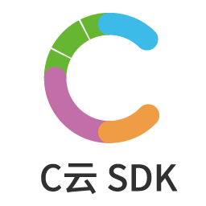

CYUN SDK是致力于帮助产品快速产品化物联网功能的设备侧SDK.

CYUN SDK在物联网云提供的基础SDK上，
进行了常见产品化功能的开发，开发者可以使用本SDK，更加聚焦于产品核心业务功能，常见产品化功能业务
通过修改配置文件或者直接实现对应接口的函数即可完成.

同时CYUN SDK还对原生SDK进行了优化和增强，以更好的满足实际产品化需要.

## 项目状态: *ALPHA*

在alpha阶段，CYUN SDK 只提供Linux(x86)版本的二进制包(32/64bit).在后续阶段会逐步提供更多平台
的二进制包以及源代码.

## 项目说明 ##

您可以查看下面这些详细文档以更清晰全面的了解CYUN SDK.

[CYUN SDK 详细介绍](docs/CYUNSDK-架构以及优势介绍.md)

[使用CYUN SDK 0代码连接 百度天工云 ](docs/使用CYUNSDK-修改修改配置文件即可连接-百度天工云.md)

[使用CYUN SDK 0代码连接 阿里物联网云 ](docs/使用CYUNSDK-修改修改配置文件即可连接-阿里物联网云.md)

[使用CYUN SDK 0代码连接 腾讯物联网云 ](docs/使用CYUNSDK-修改修改配置文件即可连接-腾讯云.md)

[使用CYUN SDK 0代码将UART串口信息发送到物联网云 ](docs/0代码即可将设备串口收发信息发送到物联网云.md)

---
## Installation ##

直接Clone或者下载即可使用:

    git clone https://github.com/cyunsdk/cyun-sdk.git　cyunsdk
    cd yunsdk

## 云连接测试 ##

CYUN SDK当前版本支持的物联网云如下表,使用CYUN SDK并不需要单独下载相应云的原生SDK.

| 物联网云         | 原生SDK路径　 | 原生SDK版本 　                                      |
| -------------- | ----------- | ------------------------------------------------- |
| 阿里云          | [阿里云原生SDK][aliyunsdk]   | 2.2.1                                   |
| 百度天工云       | [百度云原生SDK][baidusdk]    |50294a1490f48417e186b44db64a819a0f5f1cba |
| 腾讯云          | [腾讯云原生SDK][wxsdk]       |41ce3ee0907a3ccff64a45db2a77eecc9d588386 |

## CYUN SDK 架构介绍
======================================

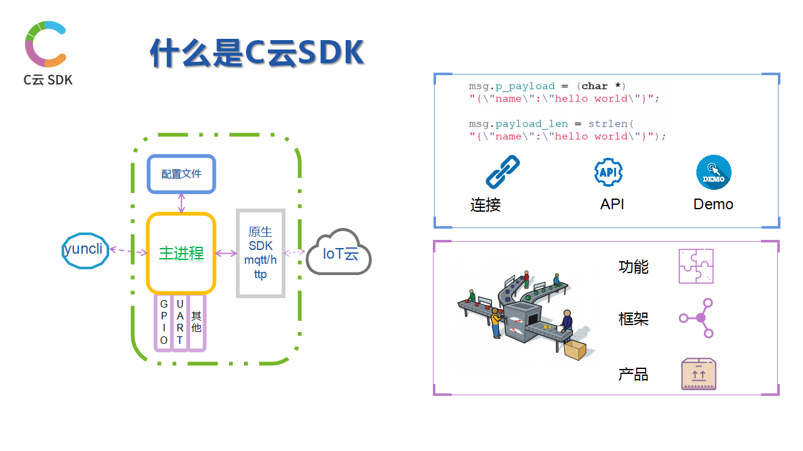

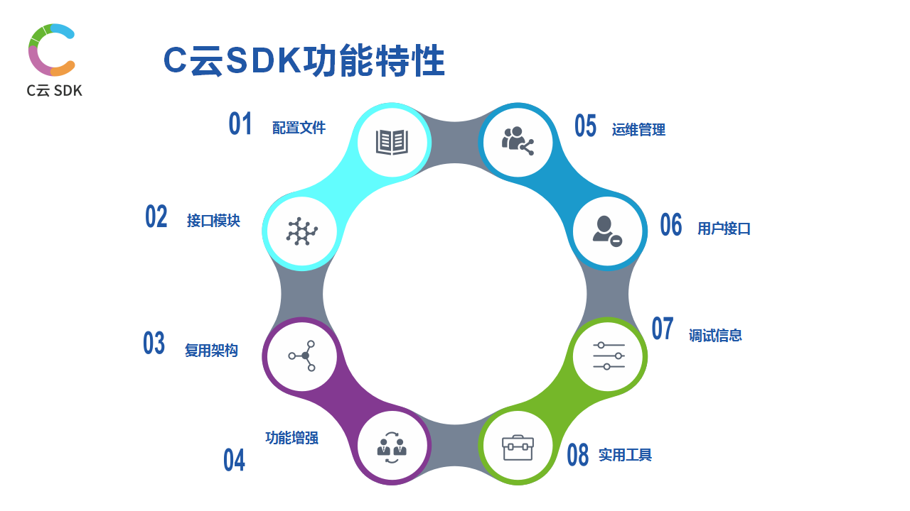

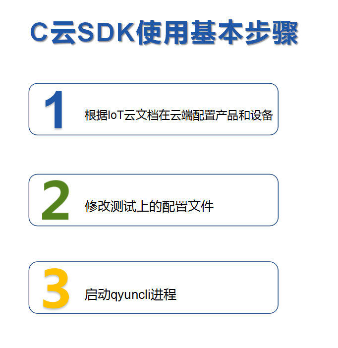

下面图片演示了通过CYUN SDK 0代码连接服务器的基本使用过程

步骤１：　修改配置文件

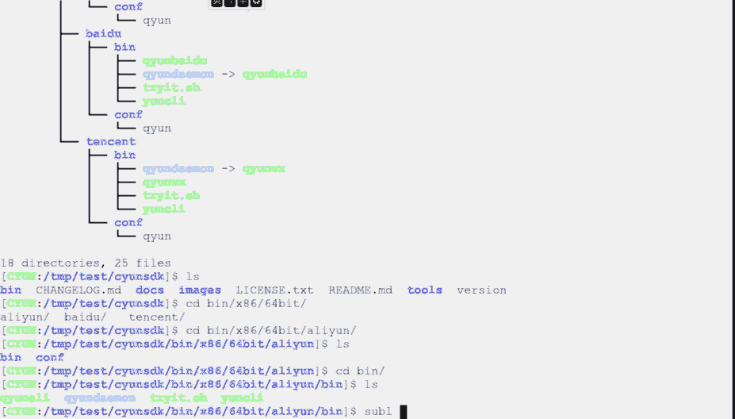

步骤２: 运行CYUN SDK

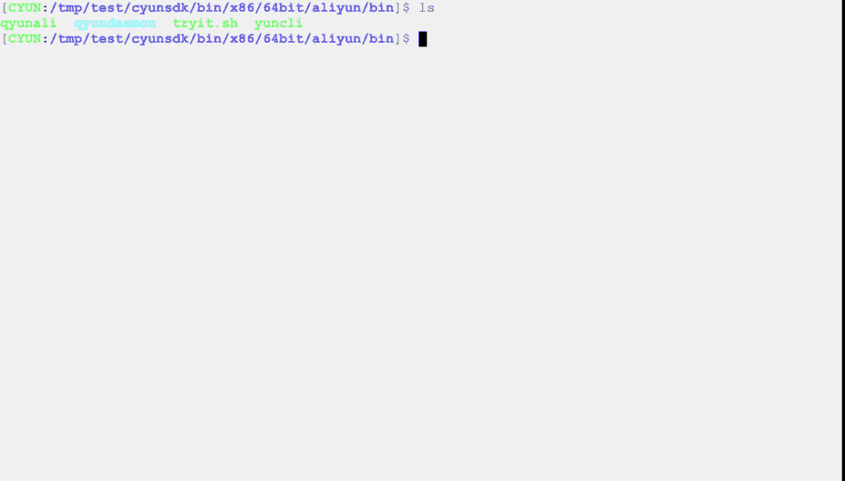

步骤3: 检查设备状态

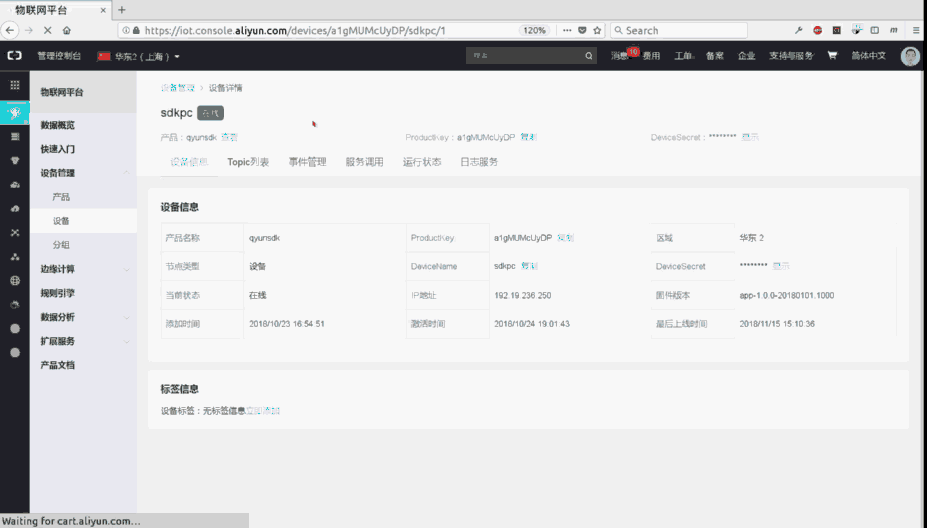

下面图片演示了通过CYUN SDK 0代码将UART接口数据转发到监控端的场景

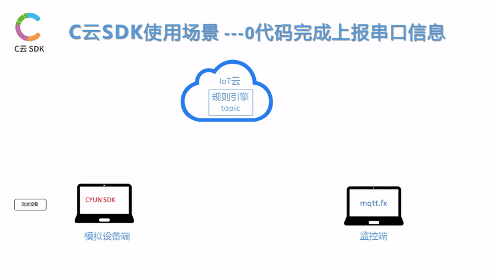

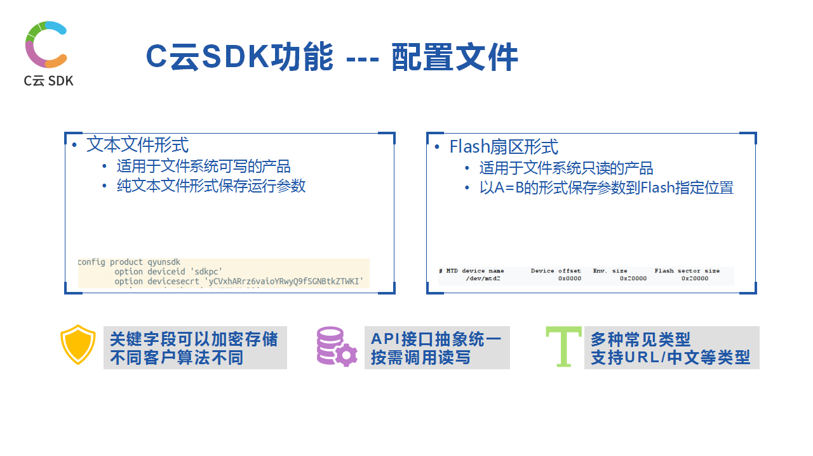

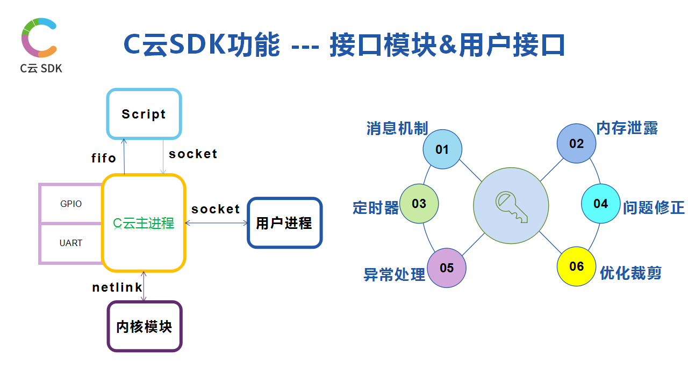

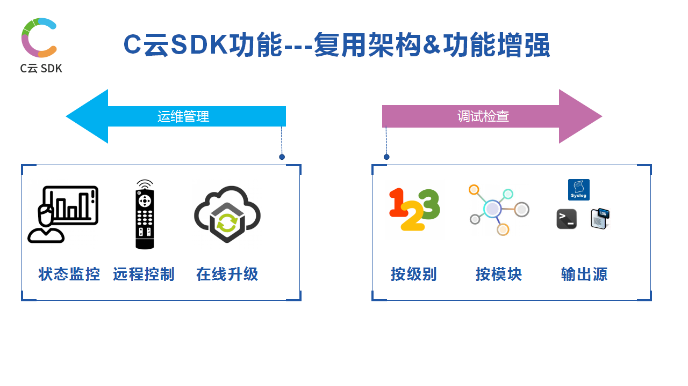

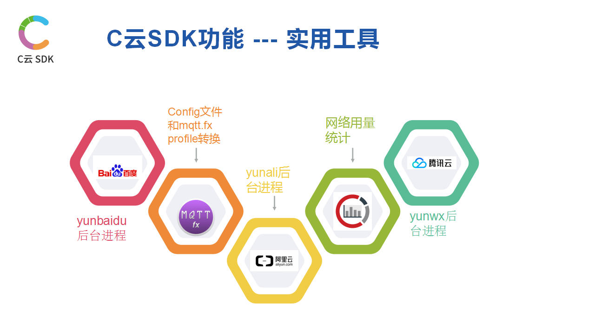

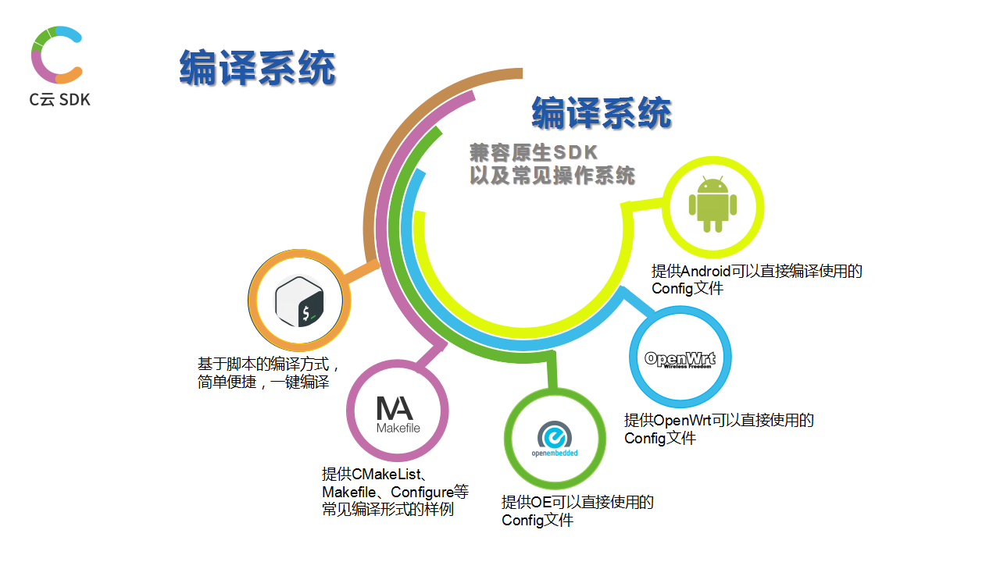

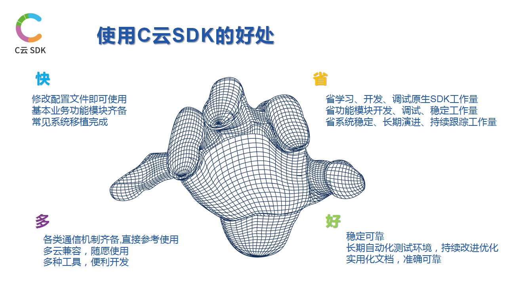

---
### yuncli 命令行使用说明 ###

yuncli 是和qyundaemon通信的调试命令行,用于测试/验证等.

---
### 文档 ###

CYUN SDK 提供丰富的文档，以便于开发、测试使用:

[CYUN SDK 编译说明](docs/CYUNSDK-build-说明.md)

[CYUN SDK yuncli使用说明](docs/CYUNSDK-yuncli-工具使用说明.md)

[CYUN SDK mqttfx工具说明](tools/mqttfx/README.md)

---
### 联系方式 ###
如果对CYUN SDK 感兴趣，欢迎通过技术　[文档网站](https://www.docdoc.top) 沟通,欢迎如QQ群交流.
如有其他任何问题,包括但不限于合作/定制/其他云移植/侵权等任意事情,欢迎联系销售人员.

| CYUN SDK QQ群　 | CYUN SDK 公众号 | 销售人员联系方式 |
| ------------- | ------------- | --- |
|   |   | 

[aliyunsdk]: https://linkkit-sdk-download.oss-cn-shanghai.aliyuncs.com/linkkit2.2.1.tar.gz?spm=a2c4g.11186623.2.16.decf5b3elSumId&file=linkkit2.2.1.tar.gz
[baidusdk]: https://github.com/baidu/iot-edge-c-sdk
[wxsdk]: https://github.com/tencentyun/qcloud-iot-sdk-embedded-c
