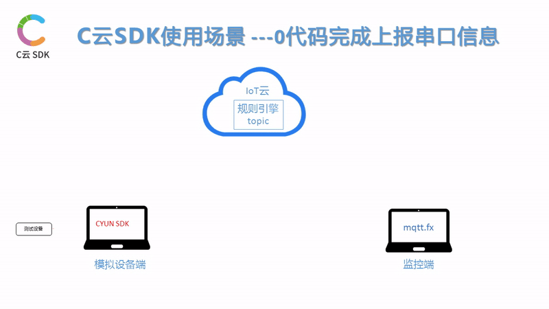

使用CYUNSDK-0代码即可将设备串口收发信息发送到物联网云
---

# 系统基本描述

此测试的基本情况参考下图说明

# 步骤１ - 配置串口参数

参考文档下述文档在配置文件中正确配置设备串口信息

[UART　参数配置说明 ](CYUNSDK-model-uart-参数说明.md)

# 步骤２ - 运行CYUN SDK

    ./tryit.sh

# 步骤３　- 在PC侧运行mqtt.fx或者其他程序

SDK会默认将串口接收到的信息以 deviceid:原始字符串　

的形式pub到mqtt的/uart消息下
每个云对于设备能够pub的信息定义格式不同,注意在服务器上定义相应的topic.

