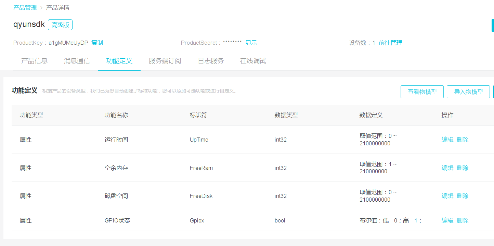
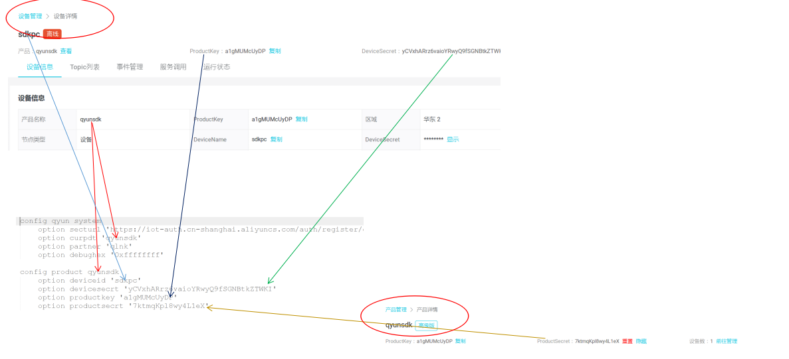
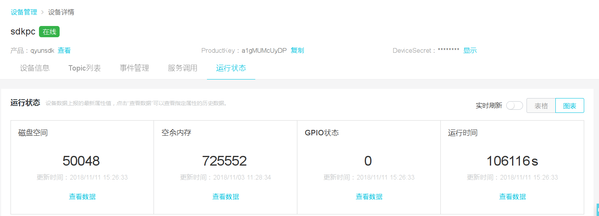

阿里云云验证测试
---
### 阿里云云验证测试 ###

#### 阿里云云服务器产品创建以及配置
参考阿里云云服务器介绍文档在云服务器侧完成产品创建以及参数配置即可

在服务器侧可以导入物模型文件 bin/aliyun/cyunsdk-ali-model.json,本步骤非必须是可选进行,导入后如下图:

注意,如果要测试物影子功能,并且使用CYUN SDK更新物影子状态,需要导入对应的物模型文件,并且创建的产品需要是高级版

---
#### 测试PC侧（模拟物联网设备）配置修改

    cd bin/aliyun/config
    参考下面图片修改此目录下的qyun文件

| 配置文档条目     | 条目含义　　 | 阿里云对应字段  | 取值　　　　　　　　　　　　 | 说明               |
| -------------- | ----------- | ------------- | ---------------- | ------------------- |
| curpdt         | 当前使用的产品名称 | 物模型名称  | 参考云服务器定义 | 人可读名称      |
| productkey     | 当前使用的产品ID | ProductKey  | 参考云服务器定义  | 产品名称数字化      |
| productsecrt   | 当前使用产品的秘钥 | ProductSecret   | NA  | NA |
| deviceid       | 每个设备的唯一标识符  | DeviceName | 参考云服务器定义  | 原生SDK里面　Name/ID 混用，个别API很难区分是针对产品的还是设备的 |
| devicesecrt    | 每个设备连接服务器的秘钥(证书) | DeviceSecret  | 参考云服务器定义 | 设备秘钥 |

---
#### 测试PC侧（模拟物联网设备）程序运行

　　　　cd bin/aliyun/bin
　　　　./tryit.sh

tryit.sh　脚本会自动调用qyunali应用程序使用conf目录下的qyun作为配置文件连接阿里云服务器

---
#### 阿里云云服务器产品状态检查

设备侧连接成功后,可以在服务器侧检查测试设备的状态信息如下图

